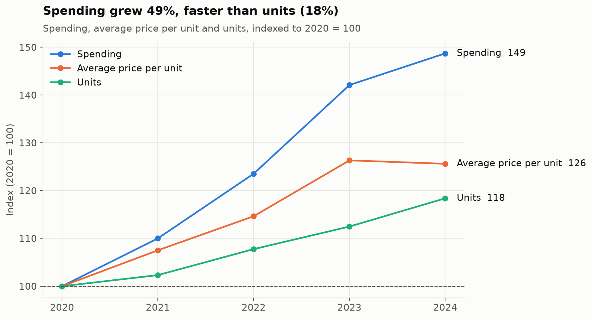
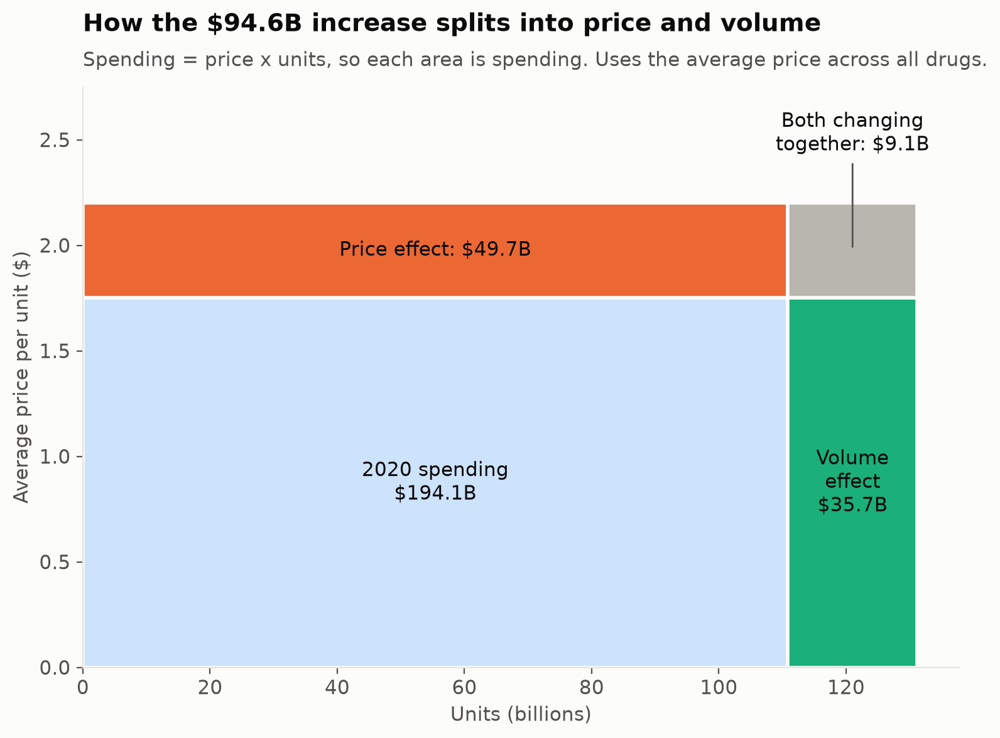
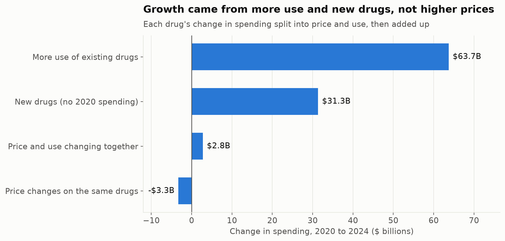
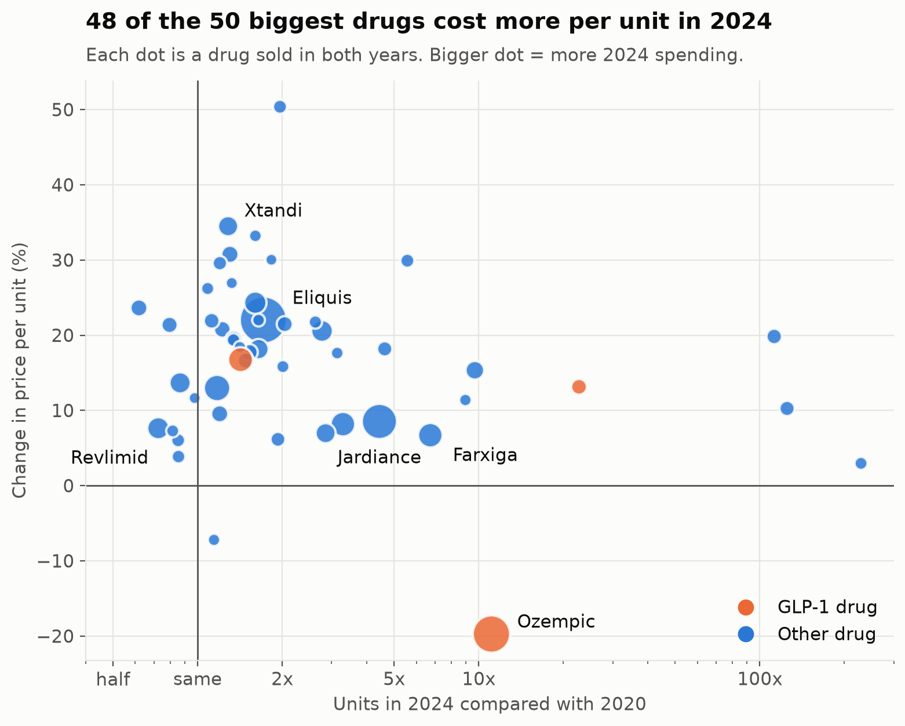
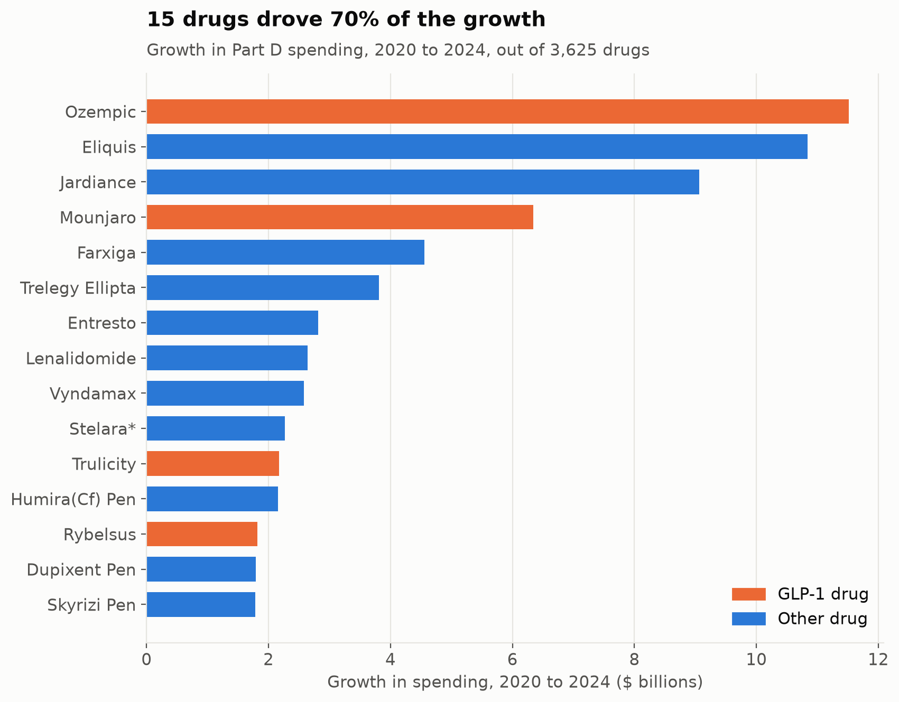
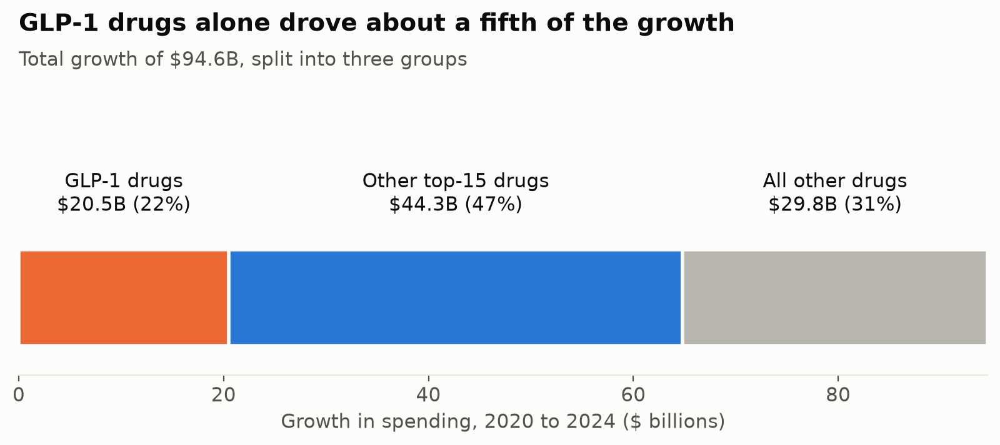

# Medicare Part D Drug Spending: Price vs. Volume

Medicare Part D spent $94.6 billion more on prescription drugs in 2024 than in 2020. This project examines the source of that growth: whether it was driven by higher drug prices or by an increase in the number of prescriptions filled.

**Status:** Complete

## Summary

**Purpose and importance.** Medicare Part D is the federal program that helps people on Medicare, mainly Americans aged 65 and older, pay for prescription drugs. It is funded mainly by taxpayers, so rapid growth in its spending affects public budgets, the premiums paid by people on Medicare, and the resources available for other public priorities. Between 2020 and 2024, Part D spending rose by 49%, from $194.1B to $288.7B. Understanding the cause of this growth matters because each cause calls for a different response: rising prices call for price controls or competition, while rising use may reflect patients gaining access to effective treatment.

**Approach.** Using CMS data covering 3,625 drugs, the analysis divides the $94.6B increase into a price effect (drugs costing more per unit) and a volume effect (more units being used). The split is carried out in two ways: first for all drugs combined, and then for each drug separately. It then identifies the drugs that contributed most to the growth, with closer study of GLP-1 drugs such as Ozempic and of the switch from brand-name Revlimid to its generic.

**Findings.** When all drugs are combined, higher prices appear to explain about half of the growth. The drug-by-drug analysis shows that this impression is misleading. Price increases on brand-name drugs such as Eliquis were offset by price reductions on insulins and generics, so the prices of the same drugs were almost unchanged overall. The growth came instead from greater use of existing drugs (67%) and from new drugs entering the market (33%). The average price rose because spending shifted toward newer, more expensive drugs. The growth was also highly concentrated: 15 drugs accounted for 70% of the increase, and GLP-1 drugs alone accounted for 22%.

**Economic implications.** The results suggest that Part D spending grew mainly because demand increased for a small number of expensive, patent-protected drugs, rather than because existing drugs became more expensive. Patents give manufacturers monopoly pricing power, and because Medicare pays most of the cost, patients and doctors face little pressure to choose cheaper options. The most relevant policy responses are therefore those that target high-use, high-price drugs: Medicare price negotiation, which already covers several of the top 15 drugs from 2026, limits on price increases, and faster competition from generics and biosimilars. Each involves a trade-off between lower spending today and the funding of future drug development. The full discussion is in the [Economic analysis](#economic-analysis) section.

## Key findings

- **Spending rose 48.7%**, from $194.1B in 2020 to $288.7B in 2024, an average of about 10.4% per year.
- **Measured across all drugs combined, price appears to be the larger driver.** The average price per unit rose 25.6%, while the number of units rose 18.4%. On this basis, price accounts for 53% of the growth.
- **Measured drug by drug, price was not the main driver.** When each drug is analysed separately, the prices of the same drugs changed very little overall (−$3.3B). Price increases on brand-name drugs such as Eliquis added $21.7B, but price reductions on insulins, some inhalers and generics removed $25.0B. The growth came from the following sources:

  | Source | Amount | Share of growth |
  |---|---|---|
  | Greater use of existing drugs | $63.7B | 67% |
  | New drugs (no 2020 spending) | $31.3B | 33% |
  | Price and use changing together | $2.8B | 3% |
  | Price changes on the same drugs | −$3.3B | −3% |

  The average price rose because spending shifted toward more expensive drugs, not because the same drugs became more expensive.
- **Growth was concentrated in a small number of drugs.** 15 of 3,625 drugs account for 70% of the increase ($66.1B). Most of these treat diabetes or heart disease, including Ozempic, Eliquis, Jardiance and Mounjaro.
- **GLP-1 drugs alone contributed 21.7% of the growth** ($20.5B), mainly through Ozempic, Mounjaro, Trulicity and Rybelsus.
- **Part of the apparent new spending reflects patients switching to a generic.** Generic lenalidomide added $2.6B, but about $1.2B of this replaced spending on the brand-name version, Revlimid. Taken together, spending on the drug grew because more patients used it (+32% units), not because of higher prices.

## Charts

**Spending grew faster than units**



**Using the average price, price appears to be the larger driver...**



**...but drug by drug, growth came from greater use and new drugs**



**Most of the largest drugs cost more per unit, but they were also used much more**



**A small number of drugs drove most of the growth**





## Method

1. **One row per drug.** The file contains one row per drug per manufacturer, plus an `Overall` row with each drug's total. Only the `Overall` rows are used (3,625 drugs), so no drug is counted twice.
2. **Reshaping.** The data is converted from one column per year into one row per drug per year.
3. **Splitting the change in spending.** Since spending equals price multiplied by units, the change is divided into:
   - **Price effect:** the change in price × 2020 units
   - **Volume effect:** the change in units × 2020 price
   - **Interaction:** the change in price × the change in units

   The three parts add up exactly to the total change.
4. **Two versions of the split:**
   - Using the **average price across all drugs**, treating them as one product
   - **For each drug separately**, then added together. Drugs with no 2020 spending have no 2020 price, so they are counted separately as new drugs.

   The difference between the two shows how much of the apparent price growth is actually spending moving to more expensive drugs.
5. **Identifying the drugs behind the growth:** the top 15 drugs, GLP-1 drugs, and brand-to-generic switching (Revlimid).

## Data checks

- No drug appears more than once in a year.
- There is no negative spending or units, and no drug has spending with zero units.
- The yearly table and the per-drug table give the same 2024 total ($288.668B).
- The four parts of the drug-by-drug split add up exactly to the $94.6B total.
- Drugs flagged by CMS as price outliers account for $2.47B of 2024 spending, less than 1% of the total.

## Economic analysis

### Why the growth matters

Medicare Part D is funded mainly by taxpayers, with the remainder coming from the monthly premiums paid by people enrolled in Medicare. Any increase in drug spending therefore has an opportunity cost: money spent on prescription drugs cannot be used for other purposes, such as hospital care, education or lower taxes. A 49% increase over four years is substantial, which makes it important to understand whether the additional spending paid for the same treatment at higher prices, or for more and newer treatment.

### What drove the increase

Total spending is the product of price and quantity, so an increase in either one raises spending. The average price per unit across all drugs rose 26%, which initially suggests that prices were the main cause. However, the drug-by-drug analysis shows that the prices of the same drugs were almost unchanged overall. Most of the growth came from greater use of existing drugs ($63.7B) and from new drugs entering the market ($31.3B), such as Mounjaro. The average price rose because spending shifted toward more expensive drugs. A household's average cost per grocery item rises in the same way if it switches from chicken to steak, even when the price of each item stays the same.

Prices did rise for many brand-name drugs. Eliquis, Imbruvica and Xtandi, for example, cost 20–35% more per unit in 2024 than in 2020. Two economic factors help explain this. First, a new drug is protected by a patent, which gives one company the exclusive right to sell it for many years. Without competition, that company has monopoly power and can set a high price and raise it over time. Second, patients usually pay only part of a drug's price, with Medicare paying the rest. Because the patient and the prescribing doctor do not bear the full cost, there is less pressure to keep prices low. Economists call this the third-party payer problem.

Other prices fell. When a patent expires, other manufacturers can sell cheaper generic versions, and the resulting competition lowers prices. Many generics in this data became cheaper between 2020 and 2024. Insulin prices also fell sharply after manufacturers cut their list prices in late 2023 and early 2024; the price per unit of Lantus, for example, fell from $28 to $6.

The growth in use reflects rising demand. The number of people enrolled in Medicare is increasing as the large baby boom generation reaches age 65. New treatments have also expanded what drugs can treat. GLP-1 drugs such as Ozempic and Mounjaro became widely used for diabetes, and doctors increasingly prescribe newer drugs such as Eliquis in place of older alternatives.

### Who was affected

The increase affected several groups in different ways:

| Group | Effect |
|---|---|
| Taxpayers | Fund most of Part D, so higher spending directs more public money to prescription drugs. |
| People enrolled in Medicare | Pay monthly premiums, which rise with total spending. For many drugs, the amount paid at the pharmacy depends on the drug's price, so more expensive drugs increase costs for patients. Since 2025, annual out-of-pocket spending on Part D drugs has been capped at $2,000 per person. |
| Patients receiving newer treatments | Benefited, since greater use often reflects access to effective medicines, such as GLP-1 drugs for diabetes. |
| Drug manufacturers | Earned higher revenue, particularly from the top 15 drugs. Part of this revenue funds research into new drugs. |

These effects illustrate a trade-off. Higher spending imposes costs on taxpayers and patients, but it also brings benefits in the form of better health outcomes and funding for future research. The aim of policy is to keep as much of the benefit as possible while reducing the cost.

### Policy responses

The findings point to three policy approaches. This project identifies where the growth came from; it does not test whether these policies are effective.

**Medicare price negotiation.** A large buyer has bargaining power and can obtain lower prices. Under the Inflation Reduction Act of 2022, Medicare can negotiate prices directly with manufacturers for some of its highest-spending drugs. Several of the top 15 drugs in this analysis have been selected: Eliquis, Jardiance, Farxiga, Entresto and Stelara, with negotiated prices from 2026, and Ozempic and Trelegy Ellipta, with negotiated prices from 2027. Because these drugs grew mainly through greater use, a lower price per unit reduces spending on every additional prescription.

**Limits on price increases.** The Inflation Reduction Act also requires manufacturers to pay rebates to Medicare when they raise prices faster than inflation, the general rate at which prices rise across the economy. This changes manufacturers' incentives by reducing the reward for large price increases. In this data, price increases on existing drugs added $21.7B to spending.

**Faster generic and biosimilar competition.** Generics are lower-cost copies of brand-name drugs, and biosimilars are lower-cost versions of biologic drugs, which are made from living cells. In this data, generic lenalidomide cost about $656 per unit, compared with $855 for brand-name Revlimid. This 23% discount is modest, because legal agreements initially limited the quantity of the generic that could be sold. Prices usually fall much further once several manufacturers compete, so earlier and broader competition would reduce prices sooner.

Each of these policies involves a trade-off. Lower prices reduce spending in the short term, but manufacturers argue that high prices fund the development of future drugs. If prices fall too far, fewer new drugs may be developed. Economists continue to debate the size of this effect.

### Managing future growth

Alongside policy changes, spending growth can be managed through the choices made by drug plans and Medicare.

- **Encouraging lower-cost options.** Drug plans can charge patients less for generics than for brand-name drugs. This price signal encourages the use of cheaper drugs without restricting access to treatment.
- **Monitoring new drugs.** A third of the growth came from new drugs, which cannot be selected for negotiation until they have been on the market for several years. Their launch prices therefore have a large effect on spending.
- **Planning for GLP-1 drugs.** Most GLP-1 growth comes from increased use rather than higher prices. Because use is rising quickly, Medicare will need to plan for continued growth in spending on these drugs.
- **Focusing on the highest-spending drugs.** Since 15 drugs account for 70% of the growth, reducing costs for those drugs would have a much larger effect than small changes across thousands of drugs.

The data ends in 2024, before any negotiated prices took effect, so it cannot show whether these policies are working. A follow-up study could repeat this analysis once CMS publishes data from 2026 onward.

Source: [Medicare Drug Price Negotiation Program: Selected Drugs (CMS)](https://www.cms.gov/initiatives/medicare-prescription-drug-affordability/overview/medicare-drug-price-negotiation-program/selected-drugs-negotiated-prices)

## Limitations

- **Spending is gross, before rebates.** Manufacturers pay rebates that CMS does not report by drug, so the true net cost is lower.
- **A unit is not the same across drugs.** A unit can be a pill, a millilitre or an injection pen. For a single drug, a change in pack or pen size can also make its price per unit appear to change. The 20% fall in Ozempic's price per unit may partly reflect this.
- **Drugs that left the market may be missing.** Every drug in the file has 2024 data, which suggests that drugs discontinued before 2024 are not included. This would make 2020 spending appear slightly lower and growth slightly higher.
- **Greater use includes patients switching between drugs.** When patients move from a cheaper drug to a more expensive one, spending on the expensive drug rises by more than spending on the cheaper drug falls.

## How to run

1. Download the CSV from the [CMS website](https://data.cms.gov/summary-statistics-on-use-and-payments/medicare-medicaid-spending-by-drug/medicare-part-d-spending-by-drug) and save it as `data/partd_raw.csv`. The `data/` folder is not tracked in git.
2. Install the packages:
   ```
   pip install -r requirements.txt
   ```
3. Open `notebooks/01_explore.ipynb` and select **Run All**. The charts are saved to `output/`.

## Project structure

```
data/partd_raw.csv          CMS source data (download separately)
notebooks/01_explore.ipynb  Full analysis
output/                     Charts
requirements.txt            Python packages
```

## Data

[Medicare Part D Spending by Drug](https://data.cms.gov/summary-statistics-on-use-and-payments/medicare-medicaid-spending-by-drug/medicare-part-d-spending-by-drug), published by the Centers for Medicare & Medicaid Services (CMS). The 2026 release covers 2020–2024 and reports total spending, dosage units, claims and beneficiaries for each drug.

## Tools

Python, DuckDB (SQL), pandas, matplotlib

## Author

Krithi Hari
